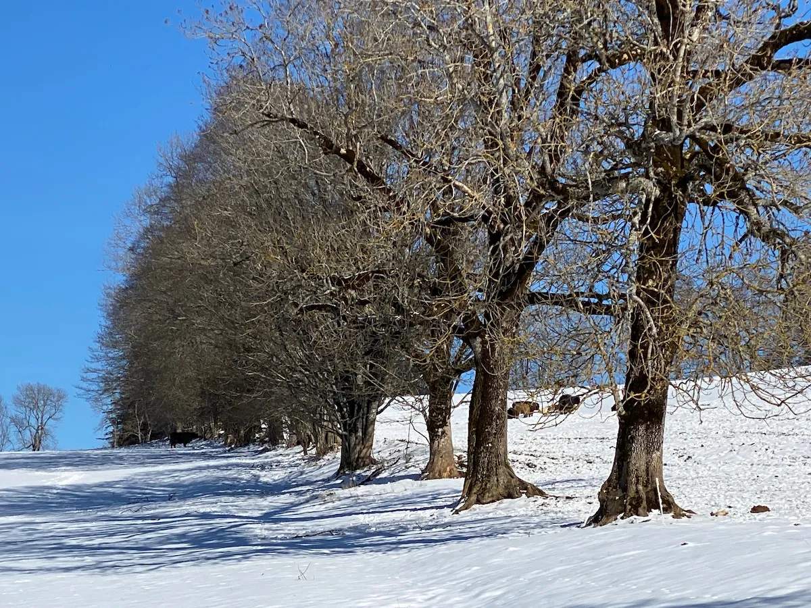
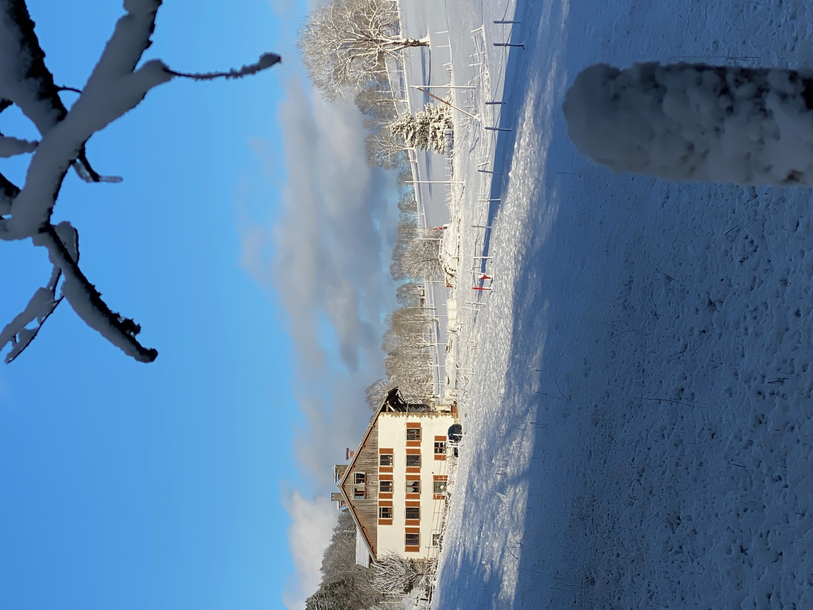

# Mon Super Parcours en Ville 🚶‍♂️📍

Bienvenue sur ce petit itinéraire de découverte !

### 🗺️ Choisissez votre format d'itinéraire

Pour suivre le parcours en ville, choisissez l'option qui vous convient le mieux :

<a href="./itineraire.geojson" style="display:inline-block; background-color:#238636; color:white; padding:10px 20px; text-decoration:none; border-radius:6px; font-weight:bold; margin-right:10px;">🗺️ Voir la Carte Interactive (GeoJSON)</a>
<a href="./TestGH.gpx" download style="display:inline-block; background-color:#21262d; color:#c9d1d9; border:1px solid #30363d; padding:10px 20px; text-decoration:none; border-radius:6px; font-weight:bold;">📥 Télécharger le fichier GPX</a>

  
💡 *L'option **GeoJSON** ouvre une carte directement dans votre navigateur. L'option **GPX** est idéale pour importer le tracé dans votre application de guidage préférée (Visorando, Komoot, Strava, etc.).*

## Étape 1 : La Place Centrale
Voici le point de départ du parcours. Admirez l'architecture du siècle dernier.

## Étape 2 : Le Parc Historique
Un endroit parfait pour une petite pause à l'ombre.

